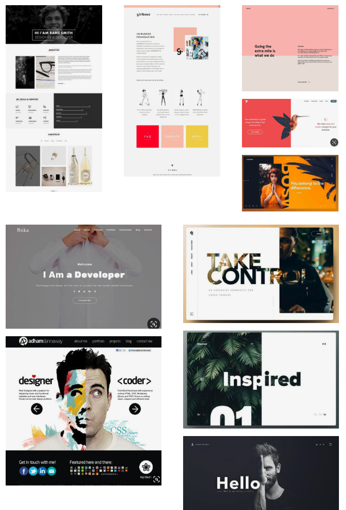
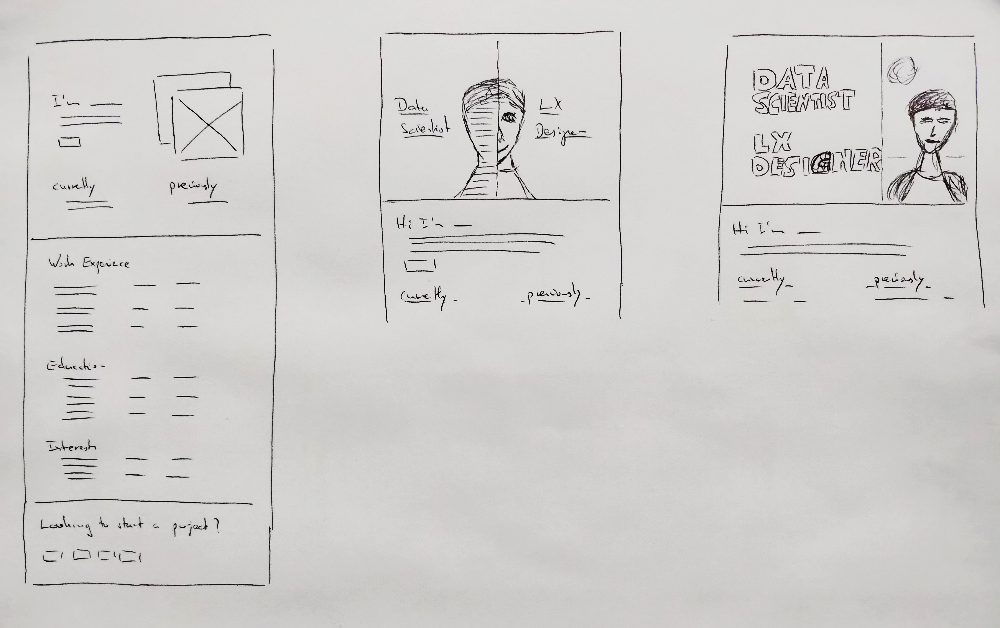
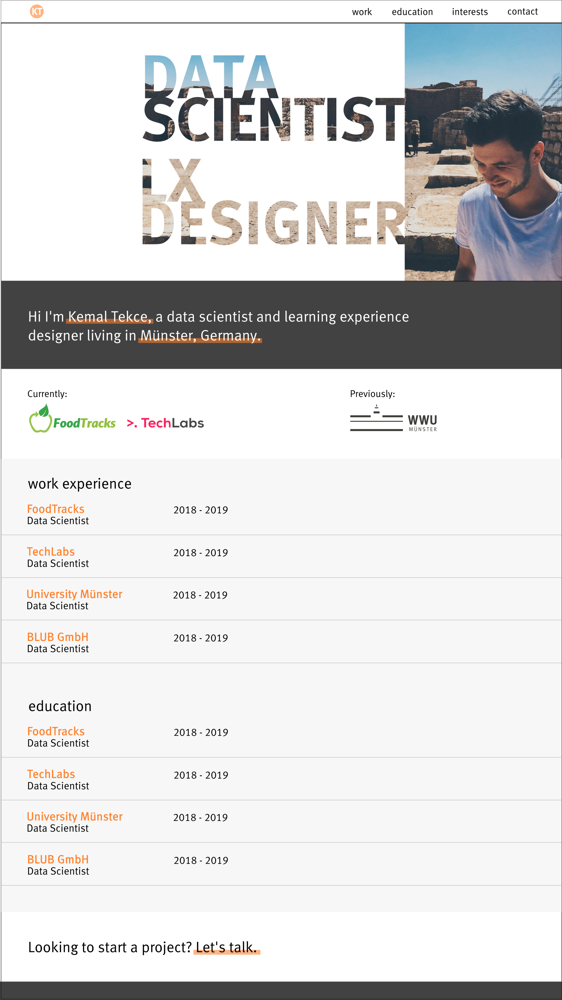
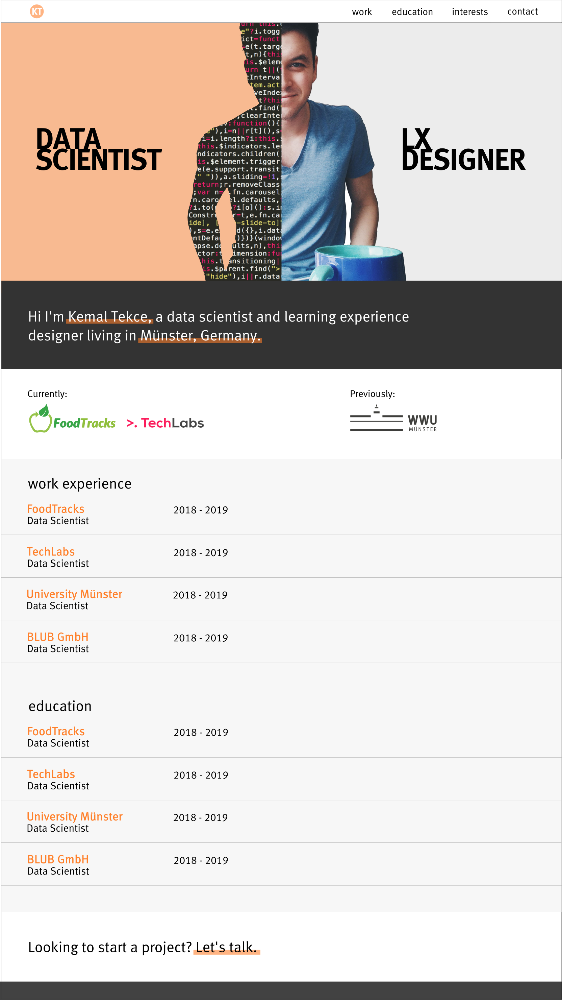
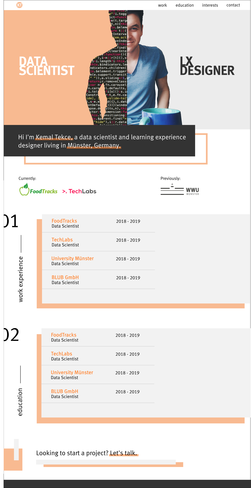

# Welcome to my own website

## Goal
With this project I had two goals in mind. Frist, I wanted to have my own site where I can show my résumé and list projects that I worked on. Second and more important, I wanted to refresh my HTML and CSS skills.

My co-worker recommanded the [Bulma](https://bulma.io) framework for the CSS part so that I can take care of most of the responsiveness more easily.

This is my first own HTML-CSS project. Therefore, the HTML and CSS won't be perfect but I just wanted to start programming and work on my own website. I wanted to learn along the way. So, if you have suggestions on how to improve my code, feel free to write me or create a pull request.

## Inspration
I had the inital idea from [Daniel Destefanis](http://danielrd.com) website, which another co-worker showed me.

After that I used Google search and Pinterest to get inspirations for how to design my own website. Below are some inspirations I collected.

## Sketching
After collecting some inspirations, I went to the drawing board and sketched a few ideas based on the inspirations above.

## Design Prototype
After sketching, I started Inkscape and made design prototypes.
Design 1|Design 2|Design 3
:-------------------------:|:-------------------------:|:-------------------------:
||

I asked family and some friends which design they find most interesting and beautiful. And with that the final decision came down to design number 3.

## Redesigned Prototype
In this step I did some design improvements, again using Inkscape.

After having a final design, I went to the keyboard and started coding. You can see the result in this github repository or on this [website](http:kmltkc.de).
